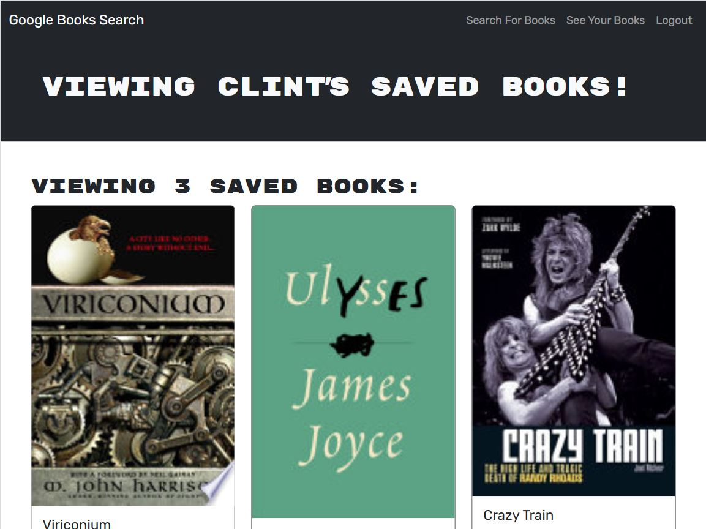

# Reshelve 

## Description

Reshelve is a MERN application using JSON Web Token user authentication and the Google Books API to manage a list of saved books. Originally it used a RESTful API, but has been refactored for Apollo server and the GraphQL API.

 
 
 
  
 
 
  
 

## Table of Contents

- [Installation](#installation)
- [Usage](#usage)
- [License](#license)
- [Contributing](#contributing)
- [Tests](#tests)
- [Questions](#questions)

## Installation

1. Change the project's root directory.  
1. Install the dependency modules: npm install  
1. Create the MongoDB database:
   - Create a server/.env (refer to the .env.EXAMPLE located there).
   - Set the database name and a random JWT password.
1. Build: npm run build  

## Usage

1. Start the server: npm run start:dev  
1. See the [spec](client/assets/docs/spec.md) for details of the original requirements  
* See the active site deployed on Render [here](https://reshelve.onrender.com/)  
Note that it takes a couple of minutes to spin up  

## License

This application is covered under the [MIT](https://opensource.org/licenses/MIT) license

## Contributing

Guidelines:  
Ensure your code follows the project's coding standards.  
Write clear and concise commit messages.  
If your changes include new features, please update the documentation accordingly.  
If you are fixing a bug, please include a test to verify the fix.  
Thank you for your contributions!

## Tests

Test instructions:  
1. Search for a title on the search page. Expect no Save button is available when you are not logged in.  
1. Verify that only Search and Login/Sign Up options are avilable.  
1. Create a new user from the login Signup. Expect a successful account creation unless information is missing or an invalid email is specified.  Expect to see additional options for See Your (saved) Books and only the Logout option.  
1. Log out, log back in with the new account. Expect that you can login successfully with a valid account.  
1. Check the saved books. Expect it to be empty if this is none have been added at this point.  
1. Search for books, add them with the Save this Book button. Expect the button text to change to This book has already been saved.  
1. Navigate to the saved books screen. Expect to see the saved books populated there.  
1. Delete a title by clicking on Delete this Book. Expect the title to be removed from the saved books screen.  
1. Save another title to populate the saved books list. Navigate to the saved books screen. Delete the id_token from your browser's local storage (this will also test an expired token without having to wait the entire expiry time). Try to delete the title. You should not have access to delete the title. Try adding another title. You should not be able to add it without a valid authentication.  
1. Login one more time to ensure that a new id_token is created. You should have access to add and remove titles in your list again.  
* Use the [Apollo Playground](http://localhost:3001/graphql) tool to test the routes while the server is running.  

## Questions

If you have any questions, feel free to reach out: 
- GitHub: [clintsrc](https://github.com/clintsrc)  
- Email: clinton.alan.jones@gmail.com

